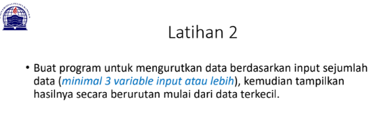
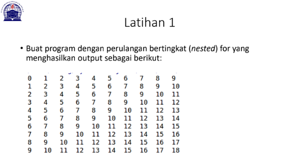

# **Kondisional dan Perulangan**

```sh
Nama    : Aef Saefuddin
Nim     : 312110521
Matkul  : Pemrograman
```

## **Lab 2 Latihan 1**

**Soal**


Saya Mengerjakan Dengan Syntax DIbawah ini

```sh
N=int(input("banyaknya data = "))
if N>0:
    i=1
    x=int(input("data ke -"+str(i)+"="))
    max=x;total=x
    for i in range(2,N+1):
        x=int (input("data ke -"+str(i)+"="))
        total+=x
        if max<x:
            max=x

    print("bilangan terbesar =",max)
```

Output yang Saya Dapatkan adalah


## **Lab 2 Latihan 2**

**Soal**



Saya Mengerjakan Dengan Menggunakan Syntax Dibawah Ini

```sh
data = []
for i in range (4):
    x =int(input("masukan bilangan : "))
    data.append(x)
print('data sebelum diurutkan: ',data)
list.sort(data)
print('data setelah diurutkan: ',data)
```
Output yang Saya Dapatkan adalah


## **Lab 3 Latihan 1**

**Soal**



Saya Mengerjakan Dengan Menggunakan Syntax Dibawah Ini

```sh
baris = 10
kolom = baris

for bar in range(baris):
    for col in range(kolom):
        tab = bar+col
        print("{0:>5}".format(tab), end='')
    print()
```

Output yang Saya Dapatkan adalah


## **Lab 3 Latihan 2**

**Soal**


Saya Mengerjakan Dengan Menggunakan Syntax Dibawah Ini

```sh
import random
print(40*"=")
print("Bilangan acak yang lebih kecil dari 0,5")
print(40*"=")
jum = int( input("Masukan nilai n : "))
i = 0
for i in range(jum):
    i += 1
    angkaDec = random.uniform(0, 0.5)
    print("Data ke", i, " = ", angkaDec)
```
Output yang Saya Dapatkan adalah


